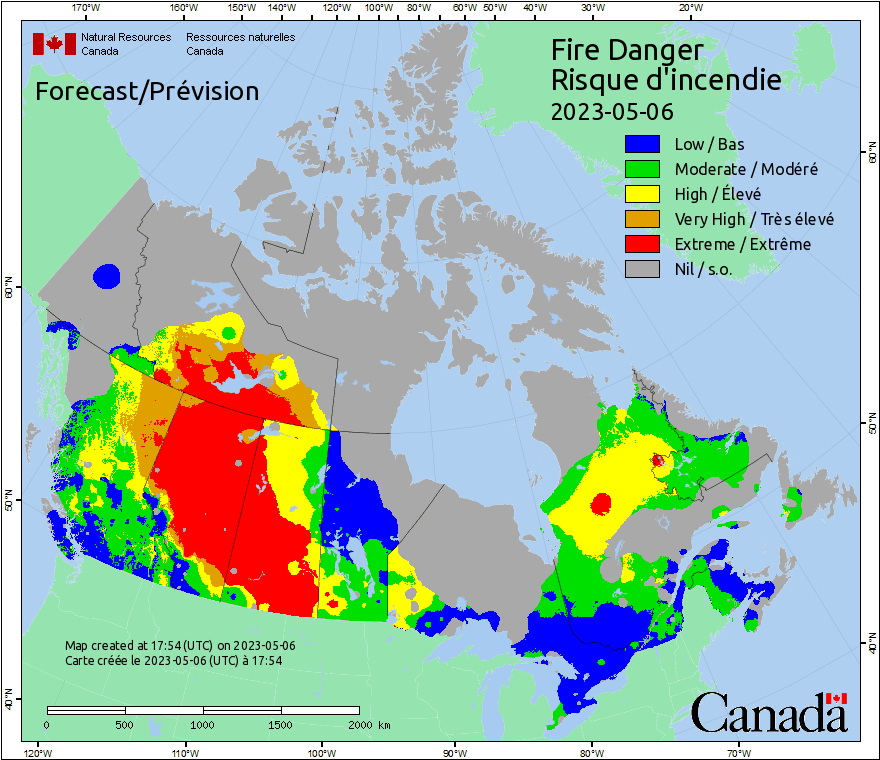

# FireCan
Visualizing the spread of Canadian wildfires by animating [Canadian Wildland Fire Information System](https://cwfis.cfs.nrcan.gc.ca/home) maps. So much smoke!

## How to run:
- clone the repository
- ensure you have [poetry](https://python-poetry.org/) installed.
- `cd` to the main `firecan` directory and run `make`.
- to scrape additional images, run `make scrape` after changing the [Configuration](#configuration) settings.
- to remake animations, run `make animate`.

## Output gifs
A couple of sample output animations, located in [firecan/assets](firecan/assets/).

| Rate of spread | Hotspots | Fire Danger |
|----|----|----|
|  |   |  | 

## Configuration
The default settings are to scrape these three maps over the past 5 weeks. These configuration settings are in **[`firecan/config/config.py`](firecan/config/config.py)**.

Two settings are important here
- `days_to_scrape`: self explanatory. Note that "fire M3 maps and reports are updated daily [only] from May through September."
- `maps_to_scrape`: There are 18 different map types available between the Fire Monitoring, Mapping, and Modeling System ([Fire M3](https://cwfis.cfs.nrcan.gc.ca/background/summary/fm3)), the Canadian Forest Fire Behavior Prediction System ([FBP](https://cwfis.cfs.nrcan.gc.ca/background/summary/fbp)), and the Canadian Forest Fire Weather Index System ([FWI](https://cwfis.cfs.nrcan.gc.ca/background/summary/fwi)). Add any elements from the `fm3_types`, `fb_types`, `fw_types`, or `w_types` lists to the `maps_to_scrape` array in the config file.

