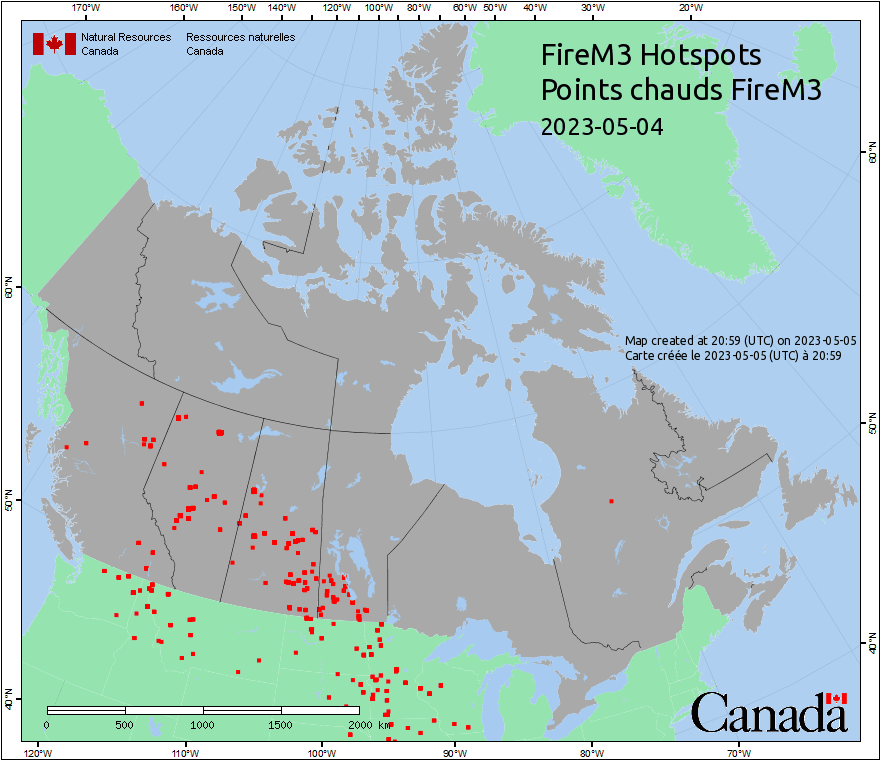

# FireCan
Visualizing the spread of Canadian wildfires.

Using map images from [Canadian Wildland Fire Information System](https://cwfis.cfs.nrcan.gc.ca/home) maps. So much smoke.

### Output gifs
A couple of sample output animations, located in [firecan/assets](firecan/assets/).

Rate of spread:

Hotspots:

